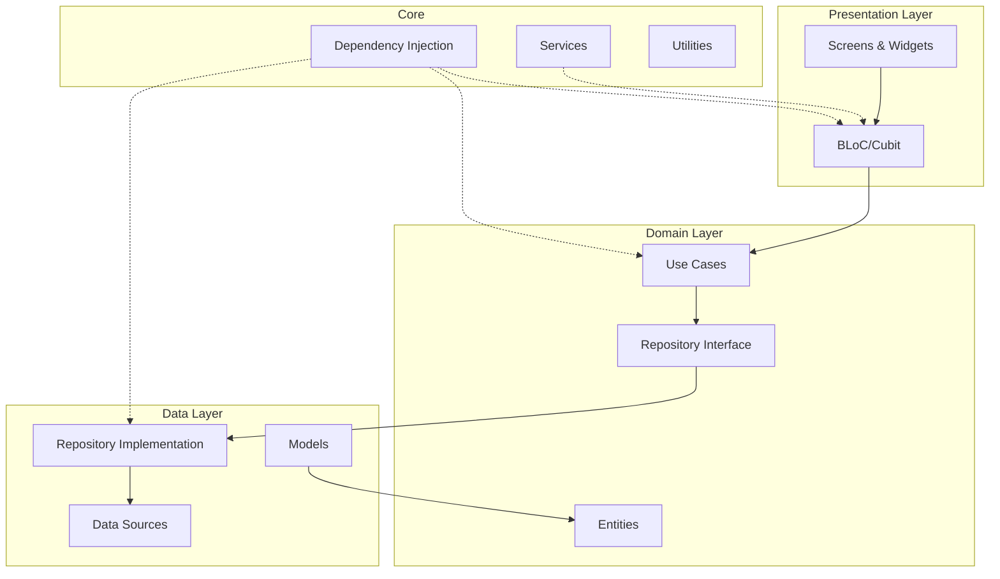
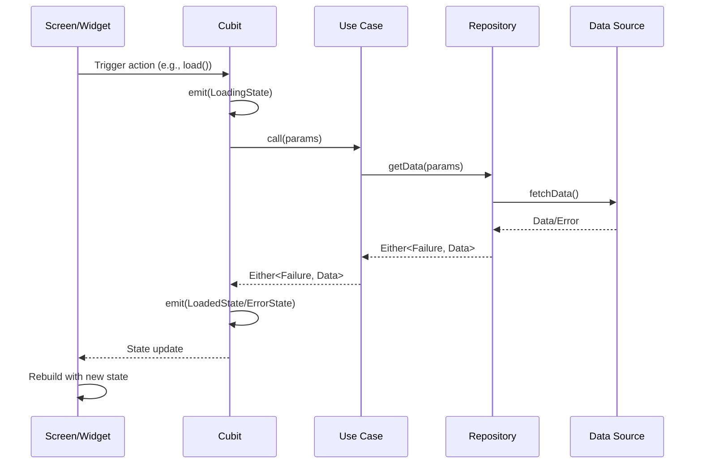
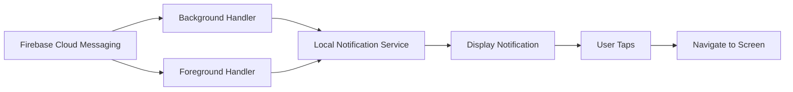

# Resiwash - Developer Onboarding Guide

## Project Overview

**Resiwash** is a Flutter-based mobile application designed as a "Laundry status companion app" that helps users monitor and manage laundry machines (washers and dryers) in residential settings. The app provides real-time status updates, notifications, and machine tracking capabilities.

- **Version**: 0.1.0+6
- **Platform**: Cross-platform (iOS, Android, Web, Windows, Linux, macOS)
- **SDK**: Dart ^3.8.1
- **Primary Language**: Dart/Flutter

---

## Architecture Overview

Resiwash follows **Clean Architecture** principles with a feature-based modular structure. The architecture is organized into three main layers:



### Key Architectural Patterns

1. **Clean Architecture**: Separation of concerns with distinct layers (Presentation, Domain, Data)
2. **BLoC Pattern**: State management using `flutter_bloc` with Cubits
3. **Dependency Injection**: GetIt service locator pattern
4. **Repository Pattern**: Abstract data access through repository interfaces
5. **Use Case Pattern**: Business logic encapsulated in single-responsibility use cases

---

## Project Structure

```
lib/
├── api/                          # API client configuration
│   └── dio.dart                  # Dio HTTP client setup
├── core/                         # Core utilities and shared code
│   ├── errors/                   # Error handling
│   ├── extensions/               # Dart extensions
│   ├── injections/               # Dependency injection setup
│   │   ├── service_locator.dart  # Main DI configuration
│   │   ├── area/                 # Area feature DI
│   │   ├── machine/              # Machine feature DI
│   │   ├── my-machines/          # My-machines feature DI
│   │   └── room/                 # Room feature DI
│   ├── logging/                  # Logging utilities
│   ├── models/                   # Shared models
│   ├── network/                  # Network utilities
│   ├── services/                 # Core services
│   │   ├── firebase_notification_service.dart
│   │   ├── local_notification_service.dart
│   │   ├── live_notification_service.dart
│   │   └── shared_preferences_service.dart
│   ├── shared/                   # Shared widgets/utilities
│   ├── theme/                    # Theme configuration
│   ├── utils/                    # Utility functions
│   └── widgets/                  # Reusable widgets
├── features/                     # Feature modules
│   ├── area/                     # Area management
│   ├── machine/                  # Machine details & listing
│   │   ├── data/                 # Data layer
│   │   │   ├── datasource/
│   │   │   ├── models/
│   │   │   └── repository/
│   │   ├── domain/               # Domain layer
│   │   │   ├── entities/
│   │   │   ├── params/
│   │   │   ├── repository/
│   │   │   └── usecases/
│   │   └── presentation/         # Presentation layer
│   │       ├── cubit/
│   │       ├── screens/
│   │       └── widgets/
│   ├── my-machines/              # User's claimed/subscribed machines
│   ├── overview/                 # Home/overview screen
│   ├── preferences/              # User preferences
│   └── room/                     # Room management
├── models/                       # Global models
├── views/                        # Legacy/shared views
│   ├── base-view.dart            # Bottom navigation shell
│   ├── my-machines/
│   └── profile/
├── firebase_options.dart         # Firebase configuration
├── main.dart                     # App entry point
├── router.dart                   # Navigation configuration
├── theme.dart                    # Theme definitions
└── util.dart                     # Utility functions
```

---

## Key Features

### 1. **Machine Management** (`features/machine/`)
- View machine details (status, type, location)
- List machines by room/area/type
- Real-time machine status updates
- Machine subscription for notifications

### 2. **My Machines** (`features/my-machines/`)
- Track claimed machines (machines user is currently using)
- Subscribe to machines for status notifications
- QR code scanning to claim machines
- Manage subscriptions and claims

### 3. **Overview/Home** (`features/overview/`)
- Dashboard showing laundry status
- Quick access to available machines
- Summary of user's active machines

### 4. **Room & Area Management** (`features/room/`, `features/area/`)
- Browse machines by location
- Room-based machine filtering
- Area-based organization

### 5. **Notifications**
- Firebase Cloud Messaging (FCM) for push notifications
- Local notifications for machine status updates
- Live Activities support (iOS)
- Multiple notification channels:
  - **Poke**: Reminders about machines
  - **Claimed**: Notifications when machines are claimed
  - **Subscribed**: Status updates for subscribed machines

---

## Core Dependencies

### State Management & Architecture
- **`flutter_bloc: ^9.1.1`** - BLoC pattern implementation for state management
- **`get_it: ^8.2.0`** - Service locator for dependency injection
- **`equatable: ^2.0.7`** - Value equality for state classes
- **`fpdart: ^1.1.1`** - Functional programming (Either type for error handling)

### Navigation
- **`go_router: ^16.1.0`** - Declarative routing with deep linking support

### Networking
- **`dio: ^5.9.0`** - HTTP client for API calls
- **`dio_cache_interceptor: ^4.0.3`** - HTTP response caching

### Firebase & Notifications
- **`firebase_core: ^4.2.0`** - Firebase initialization
- **`firebase_messaging: ^16.0.3`** - Push notifications
- **`flutter_local_notifications: ^19.5.0`** - Local notification handling
- **`live_activities: ^2.4.2`** - iOS Live Activities support

### UI & Design
- **`google_fonts: ^6.2.1`** - Custom fonts (Poppins, Open Sans)
- **`flutter_svg: ^2.2.0`** - SVG asset rendering
- **`dotted_border: ^3.1.0`** - Decorative borders
- **`implicitly_animated_list: ^2.3.0`** - Animated list transitions
- **`flutter_slidable: ^3.1.1`** - Swipeable list items

### Utilities
- **`shared_preferences: ^2.5.3`** - Local data persistence
- **`logger: ^2.6.1`** - Logging framework
- **`timeago: ^3.6.1`** - Human-readable time formatting
- **`mobile_scanner: ^7.1.4`** - QR code scanning
- **`json_annotation: ^4.0.1`** - JSON serialization annotations

### Development Tools
- **`build_runner: ^2.6.0`** - Code generation
- **`json_serializable: ^6.10.0`** - JSON serialization code generation
- **`flutter_lints: ^5.0.0`** - Linting rules

---

## State Management with BLoC

### Pattern Overview

The app uses **Cubit** (simplified BLoC) for state management:

```dart
// Example: MachineDetailCubit
class MachineDetailCubit extends Cubit<MachineDetailState> {
  final GetMachineUseCase getMachineUseCase;

  MachineDetailCubit({required this.getMachineUseCase})
    : super(const MachineDetailInitial());

  Future<void> load({required String machineId}) async {
    emit(const MachineDetailLoading());
    
    final result = await getMachineUseCase.call(machineId: machineId);
    
    result.fold(
      (failure) => emit(MachineDetailError(failure.message)),
      (machine) => emit(MachineDetailLoaded(machine)),
    );
  }
}
```

### Global Cubits

Three app-level cubits are provided at the root:

1. **`SubscriptionCubit`** - Manages machine subscriptions
   - Load/refresh subscribed machines
   - Subscribe/unsubscribe from machines
   - Check subscription status

2. **`ClaimCubit`** - Manages claimed machines
   - Load/refresh claimed machines
   - Claim/unclaim machines
   - Handle claim notifications

3. **`RoomDetailCubit`** - Manages room details
   - Load room information
   - Filter machines by room

### State Flow



---

## Navigation & Routing

The app uses **`go_router`** with a **StatefulShellRoute** for bottom navigation:

### Route Structure

```dart
AppRoutes:
  / (home)                    - HomeScreen
  /machines                   - MachineListScreen
  /machines/:machineId        - MachineDetailScreen
  /me                         - MyMachinesScreen
  /scan-qr                    - QR Scanner
  /profile                    - ProfilePage
```

### Bottom Navigation Tabs

The app has 4 main tabs managed by `StatefulShellRoute`:

1. **Home** - Overview/dashboard
2. **My Machines** - User's claimed/subscribed machines
3. **Scan QR** - QR code scanner for claiming machines
4. **Profile** - User settings

### Navigation Example

```dart
// Navigate to machine detail
context.go(AppRoutes.buildMachineDetailRoute(machineId));

// Navigate with query parameters
context.go('/machines?roomIds[]=room1&roomIds[]=room2');

// Navigate with extra data
context.go('/machines/123', extra: {
  'initialAction': InitialPageAction.subscribe
});
```

---

## Dependency Injection

The app uses **GetIt** for dependency injection, configured in [`service_locator.dart`](file:///c:/Coding/resiwash/app/lib/core/injections/service_locator.dart).

### Service Locator Setup

```dart
final GetIt sl = GetIt.instance;

Future<void> setupServiceLocator() async {
  // Async singleton
  sl.registerSingletonAsync<SharedPreferences>(
    () async => await SharedPreferences.getInstance(),
  );
  await sl.allReady();

  // Singletons
  sl.registerSingleton<FirebaseNotificationService>(FirebaseNotificationService());
  sl.registerSingleton<LocalNotificationService>(LocalNotificationService());
  
  // Feature-specific setup
  setupRoomServiceLocator();
  setupMachineServiceLocator();
  setupAreaServiceLocator();
  setupMyMachinesServiceLocator();
  
  sl.registerSingleton<LiveNotificationService>(LiveNotificationService());
}
```

### Using Dependencies

```dart
// In a Cubit
class MachineDetailCubit extends Cubit<MachineDetailState> {
  final GetMachineUseCase getMachineUseCase;
  
  MachineDetailCubit({required this.getMachineUseCase}) : super(...);
}

// Registration (in feature service locator)
sl.registerFactory(() => MachineDetailCubit(
  getMachineUseCase: sl<GetMachineUseCase>(),
));
```

---

## Firebase & Notifications

### Notification Channels

The app implements three notification channels:

1. **Poke** - Reminders to check on machines
2. **Claimed** - Alerts when machines are claimed by others
3. **Subscribed** - Status updates for subscribed machines

### Notification Flow



### Background Message Handler

```dart
@pragma('vm:entry-point')
Future<void> firebaseMessagingBackgroundHandler(RemoteMessage message) async {
  await Firebase.initializeApp();
  
  CustomFirebaseMessageChannel channel = getChannelFromString(
    message.data['channel'],
  );
  
  if (channel == CustomFirebaseMessageChannel.poke) {
    sl<LocalNotificationService>().showPoke(message);
  } else if (channel == CustomFirebaseMessageChannel.claimed) {
    sl<LocalNotificationService>().showClaimedIncomingNotification(message);
  } else if (channel == CustomFirebaseMessageChannel.subscribed) {
    sl<LocalNotificationService>().showSubscribed(message);
  }
}
```

### Notification Actions

Users can interact with notifications through actions:
- **Stop Claim Alerts** - Unclaim a machine directly from notification
- **Acknowledge Poke** - Dismiss poke reminders

---

## API Integration

### HTTP Client Setup

The app uses **Dio** for HTTP requests with interceptors for logging and error handling:

```dart
class DioClient {
  late final Dio _dio;
  
  DioClient() {
    _dio = Dio(
      BaseOptions(
        baseUrl: 'https://api.example.com',
        connectTimeout: Duration(milliseconds: 5000),
        receiveTimeout: Duration(milliseconds: 3000),
      ),
    );
    
    // Logging interceptor (debug mode only)
    _dio.interceptors.add(
      LogInterceptor(
        request: !kReleaseMode,
        requestBody: !kReleaseMode,
        responseBody: !kReleaseMode,
        logPrint: (obj) => appLog.d(obj),
      ),
    );
  }
  
  Dio get client => _dio;
}
```

### Data Flow

```
UI → Cubit → UseCase → Repository → DataSource → API
                                                    ↓
UI ← Cubit ← UseCase ← Repository ← Model ← JSON Response
```

---

## Development Workflow

### Getting Started

1. **Install Flutter SDK** (^3.8.1)
2. **Clone the repository**
3. **Install dependencies**:
   ```bash
   flutter pub get
   ```
4. **Generate code** (for JSON serialization):
   ```bash
   flutter pub run build_runner build --delete-conflicting-outputs
   ```
5. **Run the app**:
   ```bash
   flutter run
   ```

### Code Generation

The app uses code generation for:
- **JSON serialization** (`json_serializable`)
- **Asset exports** (see `asset-export.dart`)

Run code generation:
```bash
# One-time build
flutter pub run build_runner build --delete-conflicting-outputs

# Watch mode (auto-regenerate on changes)
flutter pub run build_runner watch --delete-conflicting-outputs
```

### Firebase Setup

1. Configure Firebase for your project
2. Download `google-services.json` (Android) and `GoogleService-Info.plist` (iOS)
3. Update [`firebase_options.dart`](file:///c:/Coding/resiwash/app/lib/firebase_options.dart) with your configuration

### Building for Production

```bash
# Android
flutter build apk --release
flutter build appbundle --release

# iOS
flutter build ios --release

# Web
flutter build web --release
```

---

## Key Files to Know

### Entry Point
- [`main.dart`](file:///c:/Coding/resiwash/app/lib/main.dart) - App initialization, Firebase setup, notification handlers

### Configuration
- [`router.dart`](file:///c:/Coding/resiwash/app/lib/router.dart) - Navigation routes
- [`theme.dart`](file:///c:/Coding/resiwash/app/lib/theme.dart) - Material theme configuration
- [`pubspec.yaml`](file:///c:/Coding/resiwash/app/pubspec.yaml) - Dependencies and assets

### Core Services
- [`service_locator.dart`](file:///c:/Coding/resiwash/app/lib/core/injections/service_locator.dart) - Dependency injection setup
- [`firebase_notification_service.dart`](file:///c:/Coding/resiwash/app/lib/core/services/firebase_notification_service.dart) - FCM handling
- [`local_notification_service.dart`](file:///c:/Coding/resiwash/app/lib/core/services/local_notification_service.dart) - Local notifications
- [`shared_preferences_service.dart`](file:///c:/Coding/resiwash/app/lib/core/services/shared_preferences_service.dart) - Local storage

### Feature Examples
- [`machine_detail_cubit.dart`](file:///c:/Coding/resiwash/app/lib/features/machine/presentation/cubit/machine_detail_cubit.dart) - Example Cubit
- [`subscription_cubit.dart`](file:///c:/Coding/resiwash/app/lib/features/my-machines/presentation/cubit/subscription_cubit.dart) - Complex state management example

---

## Common Tasks

### Adding a New Feature

1. **Create feature folder** in `lib/features/your-feature/`
2. **Structure the feature**:
   ```
   your-feature/
   ├── data/
   │   ├── datasource/
   │   ├── models/
   │   └── repository/
   ├── domain/
   │   ├── entities/
   │   ├── params/
   │   ├── repository/
   │   └── usecases/
   └── presentation/
       ├── cubit/
       ├── screens/
       └── widgets/
   ```
3. **Set up dependency injection** in `core/injections/your-feature/`
4. **Register in service locator** (`service_locator.dart`)
5. **Add routes** in `router.dart`

### Adding a New Screen

1. Create screen in `features/[feature]/presentation/screens/`
2. Create cubit in `features/[feature]/presentation/cubit/`
3. Add route in `router.dart`
4. Provide cubit in screen or globally in `main.dart`

### Working with Notifications

1. **Define notification channel** in `LocalNotificationService`
2. **Handle FCM messages** in `firebaseMessagingBackgroundHandler`
3. **Add notification actions** in `notificationTapBackground`
4. **Subscribe to topics** via `FirebaseNotificationService`

---

## Testing

> [!NOTE]
> The project currently has minimal test coverage. Consider adding tests as you develop new features.

### Running Tests

```bash
# Run all tests
flutter test

# Run specific test file
flutter test test/features/machine/machine_detail_cubit_test.dart
```

---

## Troubleshooting

### Common Issues

1. **Code generation errors**
   - Run: `flutter pub run build_runner clean`
   - Then: `flutter pub run build_runner build --delete-conflicting-outputs`

2. **Firebase not initialized**
   - Ensure `Firebase.initializeApp()` is called in `main()`
   - Check `firebase_options.dart` configuration

3. **Dependency injection errors**
   - Verify service is registered in appropriate service locator
   - Check registration order (dependencies must be registered before dependents)

4. **Navigation issues**
   - Ensure routes are defined in `router.dart`
   - Check `navigatorKey` is properly set

---

## Additional Resources

- [Flutter Documentation](https://docs.flutter.dev/)
- [BLoC Library](https://bloclibrary.dev/)
- [GetIt Documentation](https://pub.dev/packages/get_it)
- [GoRouter Documentation](https://pub.dev/packages/go_router)
- [Firebase Flutter Setup](https://firebase.google.com/docs/flutter/setup)

---

## Next Steps

As a new developer, you should:

1. ✅ Read this documentation thoroughly
2. 🔍 Explore the codebase starting with `main.dart`
3. 🏗️ Understand the feature structure by examining `features/machine/`
4. 🎨 Review the UI by running the app and navigating through screens
5. 📝 Try adding a simple feature or fixing a bug to get hands-on experience
6. 🧪 Write tests for your changes
7. 📚 Familiarize yourself with Flutter and BLoC patterns if new to them

Welcome to the Resiwash team! 🎉
